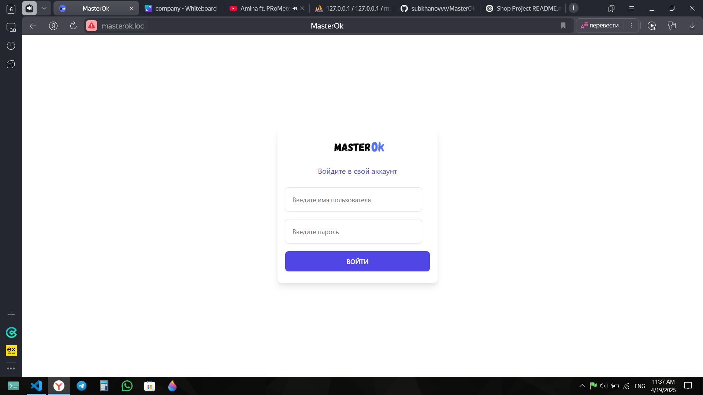
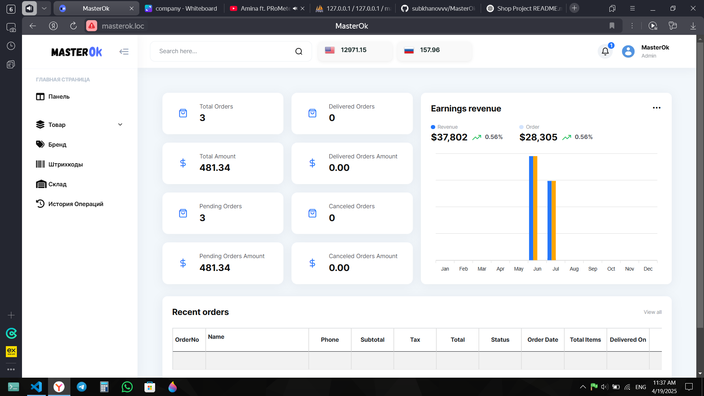

# Management System

A powerful and simple product and inventory management system built with Laravel. Supports barcode generation, stock tracking, payments, and multi-currency pricing (UZS, USD).

## ✨ Features

- 📦 Product and Inventory Management  
- 🧾 Barcode Generation and Scanning  
- 💸 Sales & Expenses with Payment Tracking  
- 💰 Multi-currency (UZS & USD) Price Management  
- 📊 Profit Calculation  
- 🔔 Inventory Status Alerts (Normal, Low, Out of Stock)  
- 📁 Categories & Brands  
- 🗂 Russian Localization (Admin Panel)

## 🖼️ Screenshots





## 🚀 Getting Started

### Prerequisites

- PHP >= 8.1  
- Composer  
- Laravel  
- MySQL or PostgreSQL  
- Node.js & npm (for assets)

### Installation

```bash
git clone https://github.com/your-username/shop-management-system.git
cd shop-management-system
composer install
cp .env.example .env
php artisan key:generate
php artisan migrate --seed
npm install && npm run dev
php artisan serve
